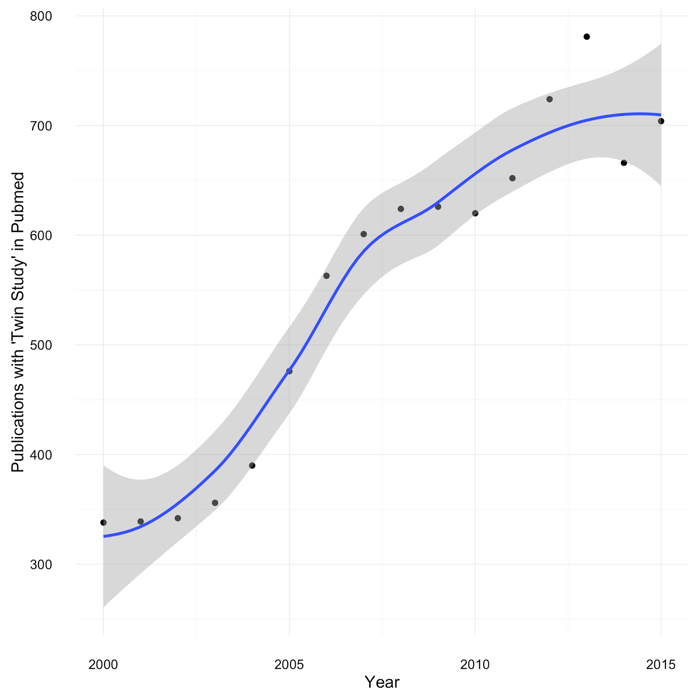

***OpenTwins*: research proposal**

Twin studies have been a valuable method to understand how heritability and the environment shape human traits since their inception in the mid-1920's (doi:10.1007/BF01067795). By comparing monozygotic twin pairs, who share 100% of their genetic information, with dizygotic twin pairs, who share on average 50% of their genetic information, it is possible to model the effects of shared environmental factors as well as of the shared genetic makeup (doi:10.1038/nrg932). Despite the recent advances in genome sequencing and molecular biology technology  twin studies remain a popular and expanding field of research, with the number of studies published per year having nearly doubled over the last 15 years (Figure 1). 

**Figure 1**: Increase in Twin Studies according to *Pubmed*.

Additionally, over the last decade, in-vitro fertilisation ​techniques are increasingly used at a global scale (doi:10.1186/s12958-016-0225-2), with the number in the UK alone having more than doubled between 1992 and 2007, according to the *Human Fertilisation and Embryology Authority* in the United Kingdom, and result in approximately 20% of dizygotic twin deliveries (doi:10.1093/humrep/dev319).

This increasing potential for twin studies is leveraged by academic & commercial twin registries, which aim at facilitating the recruitment of pairs of twins in research. The *International Society for Twin Studies* lists 33 registries in 19 countries, (http://www.twinstudies.org/information/twinregisters/) and a 2013 issue of *Twin Research and Human Genetics* lists 71 registries in 28 countries (doi:10.1017/thg.2012.147). While some commercial twin registries exist, most are largely governed by national or academic bodies, which act as mediators between twins and researchers. Twins are recruited in these registries mainly through national records or advertisements, while researchers request access to the registries through the governing bodies. Typically, researchers are required to submit a project proposal to the registry, which has to be reviewed and approved, possibly in an attempt to limit access to the registry and maintain anonymity of its members, making collaboration across twin registries rare exceptions (doi:10.1017/thg.2015.29). Importantly, access to the registries' data  often depends on intransparent criteria which do not necessarily reflect the views and needs of the twins. 

Here, we propose *OpenTwins*, a community-governed, global platform for facilitating the matching of researchers and their projects with twin pairs as an alternative to the traditional twin registries. The first goal of this platform is to bridge the disconnect between researchers and research participants that exists in all current registries. The second goal is to act as a citizen science platform, where any individual-member of the platform can assume an active role in designing scientific studies and providing ethical judgments. 

In particular, twins who wish to participate in research can register on the platform pseudonymously, and link themselves to their respective twins (Figure 2). Researchers can register as well and present their research proposals to the twin community, which can give feedback, by voting for or against them. If a research proposal gains enough support of the twin community the researcher gets permission to use the platform and send study details, a survey or a sign-up form to the twin pairs. Through this system it is assured that the complete population of twin pairs is not frequently contacted to participate in sub-standard research and that their email addresses are not shared with the researchers conducting the studies. 

**Figure 2: **Interactions within *OpenTwins*** **

Apart from facilitating recruitment of participants in ongoing twin studies, OpenTwins offers several additional advantages. First, it opens up twin research for a larger researcher-population, including citizen scientists, or young researchers, who may lack the economic or institutional means to access existing databases. Second, this platform is a democratic model to empower research participants and engage them in the scientific decision-making process.

The first milestone towards implementing *OpenTwins* is to build an online web-service. This will include a database for storing the twins' email addresses and respective twin pairs. In order to protect privacy, no other information will be required. The goal is building and launching a prototype for *OpenTwins* with minimal initial resources, to cover costs for server maintenance and work on the prototype.

A second milestone is to recruit twin pairs and/or researchers, through online advertisements in social media and citizen science platforms. A third and ultimate milestone is to reach a critical mass of few hundred twin pairs, which is a typical lower boundary in questionnaire-based twin studies. 

In summary, *OpenTwins* promises to be the first global, citizen science-driven twin registry. It will facilitate participant recruitment and by extension research in several domains, like sociology, biology or medicine. Additionally, it will enable citizen scientists or young researchers with minimal resources to contact participants and receive feedback for their planned projects. Last but not least, it will empower research participants by actively engaging them into scientific and ethical decision-making.

